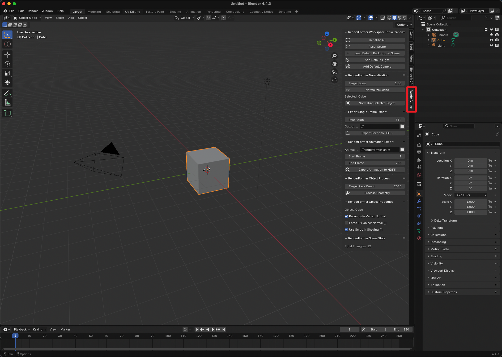
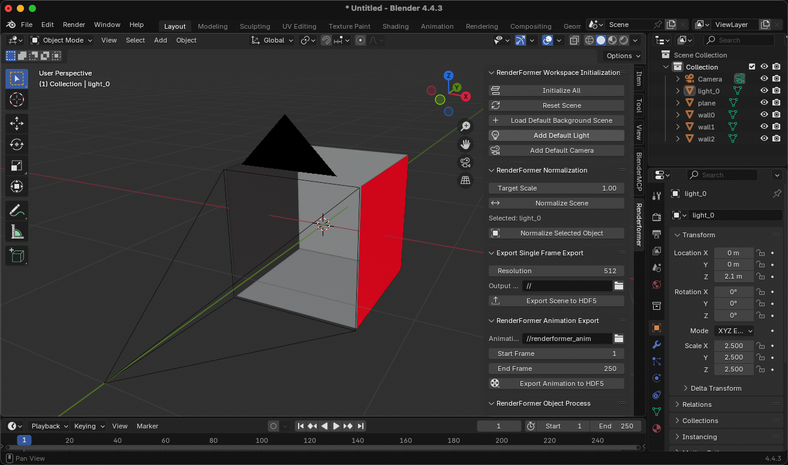
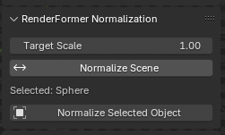
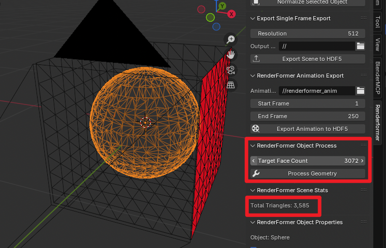
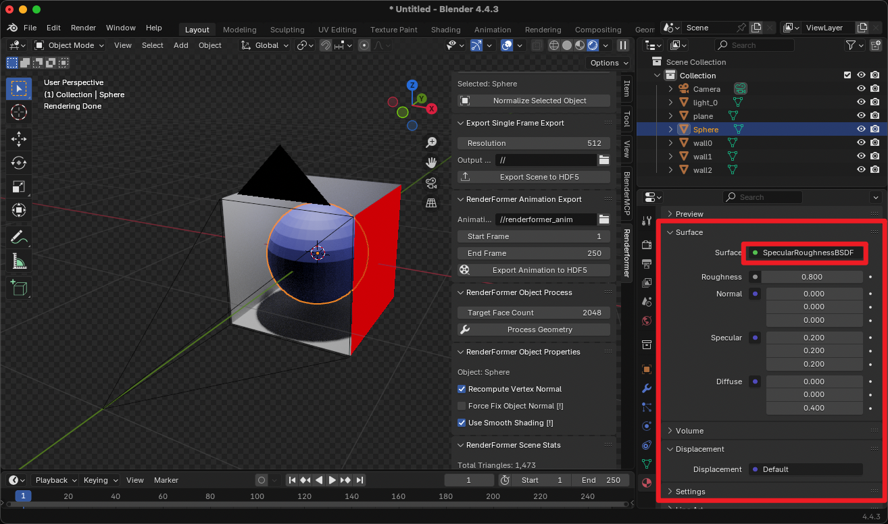
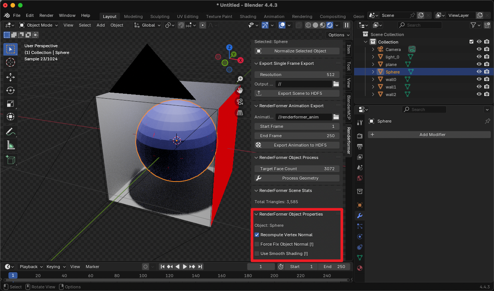
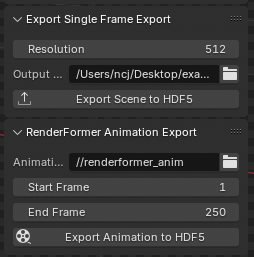
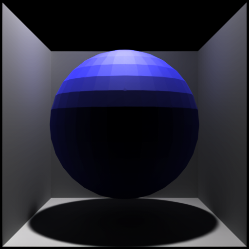

# Blender Extension for RenderFormer Demo

Check out the [website](https://microsoft.github.io/renderformer/), [paper](TBD) and official [repo](https://github.com/microsoft/renderformer) for more information.

## Install

Download the latest release from [here](TBD) and install it in Blender.

## Build

You can also build the plugin yourself using the following commands:

```bash
bash download_wheels.sh
mkdir build
blender --command extension build --split-platforms --source-dir renderformer_tools --output-dir build
```

## Usage

### 1. Find the RenderFormer Panel

After installing the plugin, you can find the `RenderFormer` panel in the Blender sidebar. If the sidebar is not visible, you can enable it by pressing `N`.



### 2. Initialize the Workspace

Click the `Initialize All` button to initialize the workspace. You should now see the default scene loaded, including the template walls, floor, as well as light source triangles and camera. Face orientation is also enabled to help you make sure all vertex normals are pointing outwards.



### 3. Place Your Own Objects

You can place your own objects in the scene.

#### 3.1 Object Scale

RenderFormer is trained with scenes roughly normalized to a unit cube. You can normalize each object / the whole scene easily by clicking the `Normalize Scene` / `Normalize Selected Object` button, and further tweak the scales using Blender.



#### 3.2 Object Geometry

RenderFormer is trained with meshes simplified by QSlim, and with the total number of triangles less than 4096. While we do not have a strict limit on the number of triangles, we recommend keeping it less than 8192 for better performance. You can remesh and reduce the number of triangles using the geometry modifies in Blender, or using the `RenderFormer Object Process` panel after you have triangulated your object.



You can check the total number of triangles in the `RenderFormer Scene Stats` panel.

#### 3.3 Object Material

We currently only support the `SpecularRoughnessBSDF` material. We support per-triangle diffuse, and monochrome specular. All properties except diffuse need to be homogeneous. The sum of diffuse and specular should be less than 1.



RenderFormer supports turning on/off smooth shading for each object. You can set this in the `RenderFormer Object Properties` panel. Some objects might have wrong normals, you can use `Force Fix Object Normal` to fix them. If you want to use the normal provided by Blender, you can unset `Recompute Vertex Normal`.



#### 3.4 Lighting Triangles

RenderFormer uses single triangles as light sources. We recommend editing the default light source triangle to achieve your lighting effects. To add more light sources, you can duplicate the light source triangle and move it around. Each light source triangle's intensity can be modified through `Emission Strength` in the material properties. We currently do not support color lighting. We support up to 8 light sources and the sum of emission strengths of all light source triangles should be with in [2500, 5000].

### 4. Export the Scene

After placing all objects, you can click the `Export Scene to HDF5` button to export the scene into a HDF5 file. You can also export a sequence of frames (e.g. after setting up animation / simulation) by clicking the `Export Animation to HDF5` button.



### 5. Render with RenderFormer

The HDF5 file can be rendered by RenderFormer!


